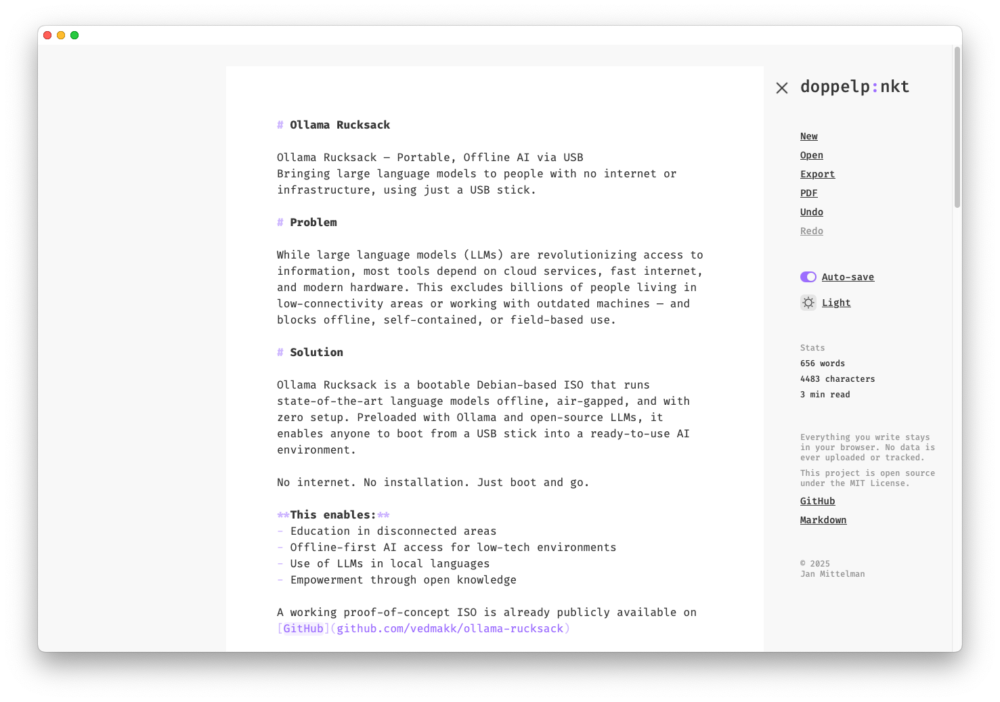

# doppelp:nkt – Minimal Markdown Editor

A **minimalist**, **distraction-free** Markdown editor – ready the moment you open it. With live syntax-aware rendering, inspired by the writing experiences in apps like **Things**.

👉 Just start writing at [doppelpunkt.io](https://doppelpunkt.io) – no sign-up required.

## ✨ Features

📝 **Markdown Input & Output**  
Text input and rendered output are the same — rendered with syntax-aware highlighting while preserving raw Markdown syntax.

➕ **New File**  
Empties the editor content. Prompts confirmation if unsaved text exists.

📂 **Open File**  
Load a local `.md` file into the editor.

💾 **Export**  
Save the current editor content as a `.md` file.

🖨️ **Print-Ready**  
Includes `print.css` for consistent printed output (or **PDF export** via Print). Make sure to select `Print backgrounds` in the print dialog when in dark mode.

💡 **Auto-Save**  
Text is auto-saved in **LocalStorage** between sessions. Auto-save is disabled by default.

☑️ **Todos**  
Features a `todo.txt`-like document to keep track of your todos in natural language using markdown.

☁️ **Cloud Sync (opt‑in)**  
Sync your `editor` and `todo` documents across devices using Firebase Auth + Firestore.

🤖 **Structured Todos (opt‑in)**
Automatically extract and organize todos from your todo document using AI. The app intelligently parses your natural language tasks, assigns due dates, and displays them in an organized list. Tasks are grouped by "Today", "Upcoming" (next 7 days), and "More" for better task management.

Two processing modes are available:

- **Cloud (OpenAI)**: Uses OpenAI API via Firebase Cloud Functions. Requires cloud sync and your own API key.
- **Local (Ollama)**: Uses a local Ollama instance on your machine. No cloud required, completely private.

↩️↪️ **Undo/Redo**  
Supports full undo/redo history for text changes.

## 🧰 Tech Stack

- [React](https://reactjs.org/)
- [TypeScript](https://www.typescriptlang.org/)
- [Vite.js](https://vitejs.dev/)
- [Redux Toolkit](https://redux-toolkit.js.org/)
- [@emotion/react](https://emotion.sh/docs/introduction)
- [Firebase](https://firebase.google.com/)
- [OpenAI API](https://openai.com/) (cloud mode)
- [Ollama](https://ollama.ai/) (local mode)

### Libraries Used

- [react-simple-code-editor](https://react-simple-code-editor.github.io/react-simple-code-editor/)
- [prismjs](https://prismjs.com) – For syntax highlighting

## 📦 Getting Started

```bash
# Clone the repo
...

# Install dependencies
bun install

# Start development server
bun run dev

# Optional: Run Firebase Emulators in another terminal
firebase emulators:start
```

## ☁️ Cloud Sync Setup

Cloud Sync is optional and disabled by default. When enabled in Settings → General, Firebase Auth/Firestore are loaded lazily.

1. Create a Firebase project and a Web App. Copy the Web App config values.
2. Enable Authentication providers:
   - Google
   - Email link (passwordless) with Action URL pointing to your app origin
3. Enable Firestore (in Native mode).
4. Create a `.env` from `.env.example` and fill in your config:

```bash
cp .env.example .env
# edit .env
```

Environment variables (Vite):

```bash
VITE_FIREBASE_API_KEY=...
VITE_FIREBASE_AUTH_DOMAIN=...
VITE_FIREBASE_PROJECT_ID=...
VITE_FIREBASE_STORAGE_BUCKET=...
VITE_FIREBASE_MESSAGING_SENDER_ID=...
VITE_FIREBASE_APP_ID=...
VITE_USE_FIREBASE_EMULATOR=false
```

### Firebase Setup

Most firebase related setup is reflected in the code (`.env`, `firebase.json`, `firestore.rules`, etc.).

Here are some additional steps that can't be done in the code:

1. Setup Hosting and connect the domain
1. Enable Cloud Functions for Firebase in the Firebase console.
1. Enable Firestore in the Firebase console.
1. Enable Authentication in the Firebase console and:
   - Enable the Google Provider to the "Sign-in method" list
   - Add production domain to the "Authorized Domains" list
1. Select the "Blaze" plan in the Firebase console (this is required to make requests to third party services within Cloud Functions)
1. Make sure to set Budgets & Alerts in the Firebase console for your billing account.
1. Set up the encryption master key for API key storage (required for Structured Todos):
   ```bash
   # Generate a secure 32-byte key and set it as a Firebase secret
   firebase functions:secrets:set ENCRYPTION_MASTER_KEY
   # When prompted, enter a secure random string (at least 32 characters)
   ```
1. Allow unauthenticated invocation for the Gen2 function’s underlying Cloud Run service in Google Cloud Console:
   - Go to Google Cloud Console → Cloud Run
   - Find the service that corresponds to your function (usually named similar to the function)
   - Permissions
   - Add principal: allUsers
   - Grant role: Cloud Run Invoker

Also, you need to create your `.firebaserc` file in the root of the project and add your project id:

```json
{
  "projects": {
    "default": "your-project-id"
  }
}
```

### Development with Emulators

Start Firebase emulators (Hosting, Firestore, Auth):

```bash
firebase emulators:start
```

Then, in another terminal, run the app:

```bash
VITE_USE_FIREBASE_EMULATOR=true bun run dev
```

Security rules (`firestore.rules`) restrict access to a user's own docs.

To test Structured Todos locally, create a `.secret.local` file in `packages/functions/` with the encryption key:

```bash
# packages/functions/.secret.local
ENCRYPTION_MASTER_KEY=your-local-test-key-at-least-32-chars
```

This file is read by the Firebase emulator and is already in `.gitignore`.

### Using Cloud Sync

1. Open Settings → General.
2. Toggle "Cloud sync" on.
3. Sign in with Google.
4. Edits are saved locally (LocalStorage) and synced to Firestore with a short debounce. Remote updates propagate live to the editor.

## 🤖 Local AI with Ollama

Structured Todos can run entirely on your machine using [Ollama](https://ollama.ai), with no cloud services required.

### Setup

1. Install Ollama from https://ollama.ai
2. Pull a model: `ollama pull llama3.2` (or any model that supports structured outputs)
3. Start Ollama: `ollama serve`
4. In the app, go to Settings → Structured Todos
5. Select "Local (Ollama)" processing mode
6. Enter your model name and click "Test Connection"
7. Enable Structured Todos

### CORS Configuration

If you're accessing the app from a non-localhost origin (e.g., https://doppelpunkt.io) or running Ollama on a different machine, configure CORS:

```bash
OLLAMA_ORIGINS=* ollama serve
# Or specify specific origins:
OLLAMA_ORIGINS=https://doppelpunkt.io ollama serve
```

## 📜 License

This project is licensed under the MIT License — use freely, modify openly, and share widely.  
See the [LICENSE](LICENSE.md) file for full details.

The Fira Code font is included under the terms of the SIL Open Font License, Version 1.1.  
See the [Fira Code License](src/theme/fonts/woff2/LICENSE) for more information.
