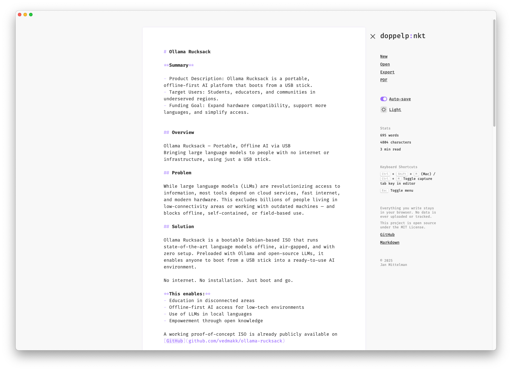

# doppelp:nkt – Minimal Markdown Editor

A **minimalist**, **distraction-free** Markdown editor – ready the moment you open it. With live syntax-aware rendering, inspired by the writing experiences in apps like **Things**.

👉 Just start writing at [doppelpunkt.io](https://doppelpunkt.io) – no sign-up required.

## ✨ Features

📝 **Markdown Input & Output**  
Text input and rendered output are the same — rendered with syntax-aware highlighting while preserving raw Markdown syntax.

➕ **New File**  
Empties the editor content. Prompts confirmation if unsaved text exists.

📂 **Open File**  
Load a local `.md` file into the editor.

💾 **Export**  
Save the current editor content as a `.md` file.

🖨️ **Print-Ready**  
Includes `print.css` for consistent printed output (or **PDF export** via Print). Make sure to select `Print backgrounds` in the print dialog when in dark mode.

💡 **Auto-Save**  
Text is auto-saved in **LocalStorage** between sessions. Auto-save is disabled by default.

☑️ **Todos**  
Features a `todo.txt`-like document to keep track of your todos in natural language using markdown.

☁️ **Cloud Sync (opt‑in)**  
Sync your `editor` and `todo` documents across devices using Firebase Auth + Firestore.

🤖 **Structured Todos (opt‑in)**  
Automatically extract and organize todos from your todo document using AI. When enabled with your OpenAI API key, the app intelligently parses your natural language tasks, assigns due dates, and displays them in an organized list. Tasks are grouped by "Today", "Upcoming" (next 7 days), and "More" for better task management.

↩️↪️ **Undo/Redo**  
Supports full undo/redo history for text changes.

## 🧰 Tech Stack

- [React](https://reactjs.org/)
- [TypeScript](https://www.typescriptlang.org/)
- [Vite.js](https://vitejs.dev/)
- [Redux Toolkit](https://redux-toolkit.js.org/)
- [@emotion/react](https://emotion.sh/docs/introduction)
- [Firebase](https://firebase.google.com/)
- [OpenAI API](https://openai.com/)

### Libraries Used

- [react-simple-code-editor](https://react-simple-code-editor.github.io/react-simple-code-editor/)
- [prismjs](https://prismjs.com) – For syntax highlighting

## 📦 Getting Started

```bash
# Clone the repo
...

# Install dependencies
bun install

# Start development server
bun run dev

# Optional: Run Firebase Emulators in another terminal
firebase emulators:start
```

## ☁️ Cloud Sync Setup

Cloud Sync is optional and disabled by default. When enabled in Settings → General, Firebase Auth/Firestore are loaded lazily.

1. Create a Firebase project and a Web App. Copy the Web App config values.
2. Enable Authentication providers:
   - Google
   - Email link (passwordless) with Action URL pointing to your app origin
3. Enable Firestore (in Native mode).
4. Create a `.env` from `.env.example` and fill in your config:

```bash
cp .env.example .env
# edit .env
```

Environment variables (Vite):

```bash
VITE_FIREBASE_API_KEY=...
VITE_FIREBASE_AUTH_DOMAIN=...
VITE_FIREBASE_PROJECT_ID=...
VITE_FIREBASE_STORAGE_BUCKET=...
VITE_FIREBASE_MESSAGING_SENDER_ID=...
VITE_FIREBASE_APP_ID=...
VITE_USE_FIREBASE_EMULATOR=false
```

### Firebase Setup

Most firebase related setup is reflected in the code (`.env`, `firebase.json`, `firestore.rules`, etc.).

Here are some additional steps that can't be done in the code:

1. Setup Hosting and connect the domain
1. Enable Cloud Functions for Firebase in the Firebase console.
1. Enable Firestore in the Firebase console.
1. Enable Authentication in the Firebase console and:
   - Enable the Google Provider to the "Sign-in method" list
   - Add production domain to the "Authorized Domains" list
1. Select the "Blaze" plan in the Firebase console (this is required to make requests to third party services within Cloud Functions)

Also, you need to create your `.firebaserc` file in the root of the project and add your project id:

```json
{
  "projects": {
    "default": "your-project-id"
  }
}
```

### Development with Emulators

Start Firebase emulators (Hosting, Firestore, Auth):

```bash
firebase emulators:start
```

Then, in another terminal, run the app:

```bash
VITE_USE_FIREBASE_EMULATOR=true bun run dev
```

Security rules (`firestore.rules`) restrict access to a user's own docs.

### Using Cloud Sync

1. Open Settings → General.
2. Toggle "Cloud sync" on.
3. Sign in with Google.
4. Edits are saved locally (LocalStorage) and synced to Firestore with a 1s debounce. Remote updates propagate live to the editor.

## 📜 License

This project is licensed under the MIT License — use freely, modify openly, and share widely.  
See the [LICENSE](LICENSE.md) file for full details.

The Fira Code font is included under the terms of the SIL Open Font License, Version 1.1.  
See the [Fira Code License](src/theme/fonts/woff2/LICENSE) for more information.
